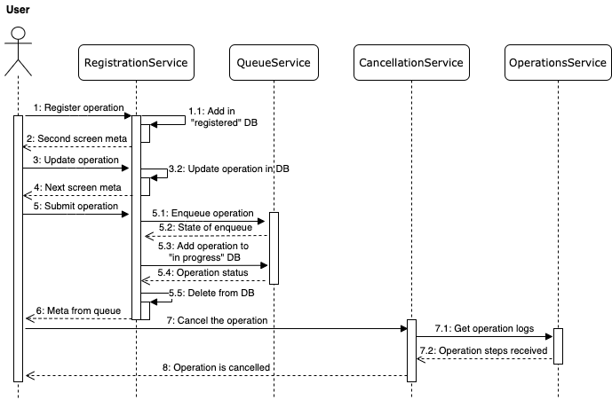
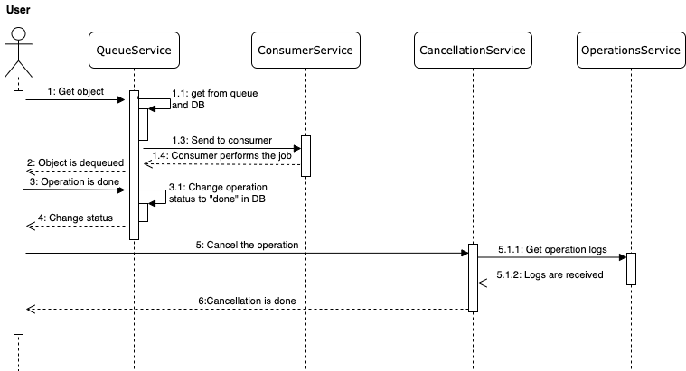

# Механизм исполнения операций банка на основе микросервисной архитектуры

В этом репозитории описано решение кейса **Механизм исполнения операций банка на основе микросервисной архитектуры**. В этом репозитории будет описана предлагаемая арзитектура и дизайн решения, а так же ссылки на части кода.

## Содержание

* [Цели](https://github.com/ilya2108/psb-general#%D1%86%D0%B5%D0%BB%D0%B8)
* [Архитектурные решения](https://github.com/ilya2108/psb-general#%D0%B0%D1%80%D1%85%D0%B8%D1%82%D0%B5%D0%BA%D1%82%D1%83%D1%80%D0%BD%D1%8B%D0%B5-%D1%80%D0%B5%D1%88%D0%B5%D0%BD%D0%B8%D1%8F)
* [Контекстная диаграмма](https://github.com/ilya2108/psb-general#%D0%BA%D0%BE%D0%BD%D1%82%D0%B5%D0%BA%D1%81%D1%82%D0%BD%D0%B0%D1%8F-%D0%B4%D0%B8%D0%B0%D0%B3%D1%80%D0%B0%D0%BC%D0%BC%D0%B0)
* [Референсные архитектуры и паттерны](https://github.com/ilya2108/psb-general#%D1%80%D0%B5%D1%84%D0%B5%D1%80%D0%B5%D0%BD%D1%81%D0%BD%D1%8B%D0%B5-%D0%B0%D1%80%D1%85%D0%B8%D1%82%D0%B5%D0%BA%D1%82%D1%83%D1%80%D1%8B-%D0%B8-%D0%BF%D0%B0%D1%82%D1%82%D0%B5%D1%80%D0%BD%D1%8B)
* [Взаимодействие компонентов](https://github.com/ilya2108/psb-general#%D0%BA%D0%BE%D0%BD%D1%82%D0%B5%D0%BA%D1%81%D1%82%D0%BD%D0%B0%D1%8F-%D0%B4%D0%B8%D0%B0%D0%B3%D1%80%D0%B0%D0%BC%D0%BC%D0%B0)
* [Дизайн решения](https://github.com/ilya2108/psb-general#%D0%BA%D0%BE%D0%BD%D1%82%D0%B5%D0%BA%D1%81%D1%82%D0%BD%D0%B0%D1%8F-%D0%B4%D0%B8%D0%B0%D0%B3%D1%80%D0%B0%D0%BC%D0%BC%D0%B0)
* [Инструкция к запуску](https://github.com/ilya2108/psb-general#%D0%BA%D0%BE%D0%BD%D1%82%D0%B5%D0%BA%D1%81%D1%82%D0%BD%D0%B0%D1%8F-%D0%B4%D0%B8%D0%B0%D0%B3%D1%80%D0%B0%D0%BC%D0%BC%D0%B0)
* [Полезные ссылки](https://github.com/ilya2108/psb-general#%D0%BA%D0%BE%D0%BD%D1%82%D0%B5%D0%BA%D1%81%D1%82%D0%BD%D0%B0%D1%8F-%D0%B4%D0%B8%D0%B0%D0%B3%D1%80%D0%B0%D0%BC%D0%BC%D0%B0)
* [Рекомендации разработчикам]()

## Цели

Целью задачи является создание ядра системы исполнения операций банка, которое должно соответствовать нескольким архитектурным принципам:

* Предложенное решение должно быть на основе **микросервисной архитектуры**;
* Для распределенного выполнения операции должна использоваться **событийно-ориентированная архитектура**;
* Решение должно быть в стеке языков программирования **C# или Java**;
* Для улучшения работы команды необходимо внедрить технологии **CI/CD**, которые позволят автоматизировать часть процессов.

## Архитектурные решения

На основе вышеуказанных архитектурных принципов должны быть приняты соответствующие архитектурные решения. Таким образом, решение должно обладать следующим набором свойств:

* Грамотная микросервисная архитектура должна обладать несколькими важнейшими качествами: **сильное зацепление** и **низкая связанность**. Сильное зацепление отвечает за то, чтобы каждый компонент отвечал **только за свою задачу** и **общался с другими сервисами** для выполнения функционала более высокого уровня (где используется больше одного сервиса). В то же время, низкая связанность отражает то, что микросервисы **не имеют сильной зависимости друг от друга**. Это позволяет разрабатывать каждый компонент экосистемы независимо;
* Наличие большого числа микросервисов и стремление к отказоустойчивости приводит к мысли об **использовании технологии оркестрации**, такой как [Kubernetes](https://kubernetes.io/);
* Поскольку использование Java является принципиальным, а Kubernetes - необходимым, то можно предложить технологию [Quarkus](https://quarkus.io/) для реализации серверной части. Помимо того, что эта среда является родной для Kubernetes, она еще и гораздо более **эффективна по памяти** (более чем в 10 раз) и **скорости** (более чем в 225 раз) по сравнению с традиционным облако-ориентированным стеком технологий.

## Контекстная диаграмма

Здесь представлена контектсная диаграмма решения. В ней задействованы три возможные роли: **клиент** (конечный пользователь), **сотрудник банка**, обслуживающий клиента, и **техническая поддержка**, которая следит за качеством работы сервиса. Сама система имеет несколько подсистем:

* **Регистрация операции**. Эта подсистема отвечает за помощь в динамической отрисовке UI и регистрации операций. После выполнения регистрации операции попадают в подсистему *обработки операций*;
* **Обработка операции**. Компонент отвечает за контроль очередью операций и за их асинхронное выполнения. Каждый шаг тоже фискируется в подсистеме журналировани. Более того, все действия с операциями попадают в подсистему *общего журналирования*, суть которой будет разъяснена ниже;
* **Журналирование операций**. Данный модуль отвечает за ведение журнала работы с операциями. Он фиксирует все действия, которые были осуществлены в рамках той или иной операции. Он будет активно использоваться в системе **отмены операции**.
* **Отмена операции**. Этот компонент является одной из главных особенностей системы. Дело в том, что отмена **операции можно проводиться даже после успешного выполнения**. Поэтому этот сервис вынесен в отдельную структуру.

## Референсные архитектуры и паттерны

Одной из главных вещей при разработке архитектуры решения важны референсные архитектуры и паттерны, которые соответствуют предметной области

### Микросервисная архитектура

Один из [основных источников](https://microservices.io/) о микросервисной архитектуре определяет ее основные свойства как:

* **Высоко доступная** и тестируемая;
* **Низкая связанность**;
* **Независимо разветываемые компоненты**;
* Сервисы **организованы в соответствии с возможностями бизнеса**;
* Каждый сервис находится под **управлением маленькой команды**.

Предлагаю проанализировать каждый пункт. Возможность обеспечить высокую доступность является **одним из преимуществ** технологии Kubernetes. В нем есть процессы управления, которые по факту независимы и компонуемы. Это приводит к тому, что нам неважно какой будет маршрут между сервисами, что исключает централизованный контроль.
Благодаря этому система теперь не только проста в использовании, мощная, надежная, но и устойчивая и расширяемая.

Стоит отметить, что низкая связанность компонентов в архитектуре обеспечивается **слабой зависимостью** одной подсистемы от другой (каждый сервис может выплонять большинство своих задач, если связанные сервисы недоступны). Это же приводит к **независимой развертываемости** сервисов и **уменьшению команды поддержки** каждого сервиса.

Таким образом, можно сделать вывод, что **решение соответствует микросервисному паттерну**.

### Database-per-Service архитектура

Этот паттерн непосредственно вытекает с микросервисной архитектурой, так как отвечает за организацию данных в микросервисах. Более того, использование этого паттерна является **обазятельным для событийно-ориентированной архитектуры**.

Он заключается в том, что **каждый микросервис содержит в себе базу данных**, к которой обращается. Более того, он является **единственным сервисом**, который взаимодействует с этой базой данных.

В решении мы используем этот паттерн, так как у нас есть три базы данных: зарегистрированные операции (подсистема **регистрации**), операци, выплоненные успешно или выполняемые сейчас (подсистема **обработки**) и информация о действиях в рамках операциях (подсистема **журналирования**). И только соответствующие подсистемы могут с ними взаимодействовать, из чего можно сделать вывод, что **решение использует Database-per-Service pattern**

### Событийно-ориентированная архитектура

Особенностью этой архитектуры является то, что **данные могут обрабатываться** несколькими сервисами. Это достигается за счет того, что существует отдельная сущность, отвечающая за **очередь операций, которые ждут выполнения**.

В нашем случае за это отвечает сервис **обработки операции**, в котороый помимо своей базы данных (см. Database-per-Service) есть еще и очередь Apache Kafka. Вышеуказанное можно назвать **использованием паттерна событийно-ориентированной архитектуры**

## Взаимодействие компонентов

Мы поговорили о принятых решениях в рамках проекта и о лучших практиках в индустрии. Теперь настало время посмотреть на взаимодействие между компонентами в двух этапах операции: **регистрации** и **обработке**.

На рисунке ниже представлена диаграмма взаимодействия компонентов при регистрации:

Здесь важно отметить, какие метаданные мы отправляем в качестве ответа. Мы отправляем **поля операции, которые еще не заполнены**. Это позволит на клиентской стороне выстроить UI таким образом, чтобы **заполнить оставшиеся поля**.

На этом изображении представлена диаграмма взаимодействия компонентов для обработке:

## Дизайн решения

Итак, вишенка на торте: **итоговый дизайн решения**. Он изображен здесь:

Давайте проанализируем каждую часть дизайна:

1. Разработчики делают коммиты в **разные репозитории с сервисами**;
2. Коммит в отслеживаемую ветку запускает CI pipeline, который выполняет две функции: **загрузка изображения в приватное хранилище** и **развертывания в Kubernetes в Azure**
3. В самом кластере находятся три сервиса. Каждый из них имеет документацию в Swagger:
   * **Регистрация**. Он имеет API, написанный на Quarkus и базу данных PostreSQL;
   * **Обработка**. Стек технологий не отличается от регистрации, разве что появляется Kafka для хранения событий;
   * **Журналирование**. Опять же, реализация похожа на сервис регистрации, но теперь там есть еще инструменты, ускоряющие поиск: ElasticSearch и LogStash (дополняет журнал данными о клиенте).
  
4. Техническая поддержка сможет следить за состоянием кластера с помощью ElasticSearch, Kibana, LogStash (ELK).
5. Также реализован **пример внешней системы** для того, чтобы эмулировать вызов внешней системы.

## Инструкция к запуску

Все три сервиса находятся в отдельных репозиториях. Для того, чтобы локально развернуть систему, необходимо выполнить следующие шаги:

1. TODO
2. TODO

## Полезные ссылки

TODO

## Рекомендации разработчикам

Разработчикам нужно понять, что мы требуем от каждой операции. По этой причине мы реализовали **интерфейс, описывающий требуемый функционал**. В нашем видении операция состоит из следующих полей:

* TODO
* TODO
